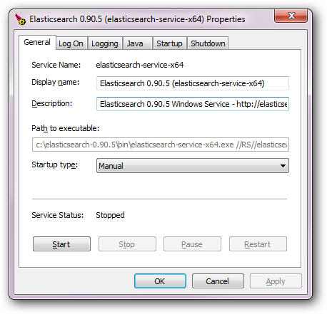

### 在Windows上以服务运行

Windows用户可以配置ES作为服务，这样就可以在后台运行或者在开机时不用任何的用户交互就能自动启动。哲可以通过`bin/`目录下面的`service.bat`脚本实现，该脚本使安装，卸载,管理或者配置服务，开启和停止服务等所有的操作都在命令行完成。

> **<pre>
c:\elasticsearch-2.3.4\bin>service
Usage: service.bat install|remove|start|stop|manager [SERVICE_ID]
> </pre>**

该脚本需要一个参数（需要执行的命令），接着一个可选的表示服务id的参数（在安装多个ES服务的时候很有用）

可用命令如下：

`install`

安装ES以作为一个服务

`remove`

移除已安装的ES服务（如果是已经启动的话，还会停止服务）

`start`

启动ES服务（如果已经安装）

`stop`

停止ES服务（如果已经启动）

`manager`

启动一个管理已安装服务的图形界面

注意，在安装的时的环境配置选项在服务的整个生命周期都会被被复制和使用。这意味着在安装之后对它们的任何改动都不会生效，除非服务重装。

基于已安装可用的 JDK/JRE(通过`JAVA_HOME`设置)的架构，合适的64位（x64）或者32位（x86）服务服务会被安装。这个信息在安装时能够看到：

> **<pre>
c:\elasticsearch-{version}bin>service install
Installing service      :  "elasticsearch-service-x64"
Using JAVA_HOME (64-bit):  "c:\jvm\jdk1.8"
The service 'elasticsearch-service-x64' has been installed.
> </pre>**

### 注意

尽管JRE可以被ES服务使用，由于其使用了客户端虚拟机（相对于服务端JVM能为长久运行的应用提供更好的性能），其不备推荐使用并且会发出一个警告。

### 自定义服务设置

有两种自定义服务设置的方式：

管理器图形用户界面

通过`manager`命令访问，图形用户界面提供了洞察已安装服务的除其他东西外包括其状态，启动类型，JVM,启动和停止设置的能力。只需从命令行带上前面说的选项调用`service.bat`，就会打开管理器窗口：

自定义`service.bat`

在其核心部分，`service.bat`依赖[Apache Commons Daemon](http://commons.apache.org/proper/commons-daemon/)项目去安装服务。为了完全的灵活性，例如自定义用户处在哪个运行的服务之下，这样就可以修改安装参数去调整所有的相关参数。记住为了使新的设置生效需要重装服务。

#### 注意

有社区支持的，可自定义的MSI安装器可以使用：

[https://github.com/salyh/elasticsearch-msi-installer](https://github.com/salyh/elasticsearch-msi-installer)（by Hendrik Saly）。